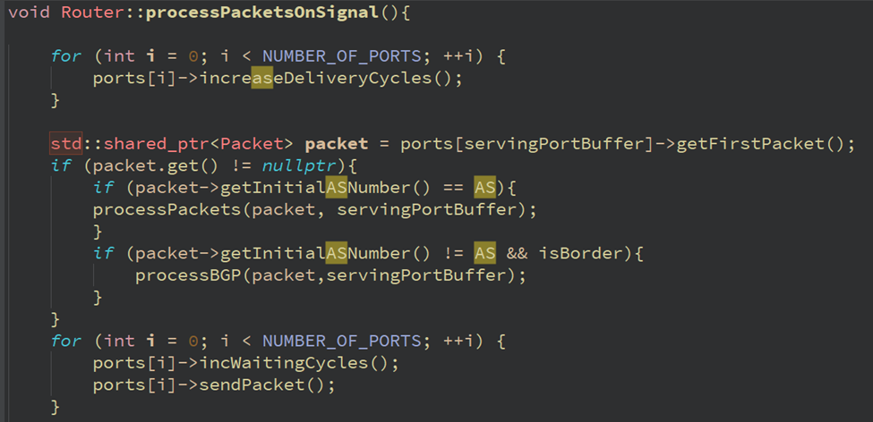
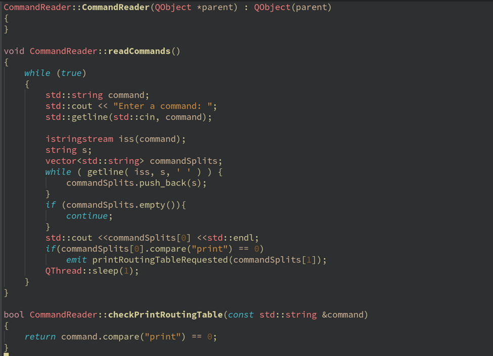

# پیاده سازی‌ شبیه‌ ساز‌شبکه‌برا‌ی بررس‌ی الگوریتم‌های مسیریابی‌
### فربد عظیم محسنی - ۸۱۰۱۰۰۱۸۷
### سید احمد رکنی حسینی - ۸۱۰۱۰۰۱۵۴

## توضیحات پروژه
هدف این تمرین پیاده‌سازی‌ یک‌شبیه‌ ساز رویداد‌محور (Driven Event)‌ به وسیله فریم وورک QT است تا‌ با‌ استفاده‌ از‌ آن‌ بتوان
پاسخگویی‌الگوریتم‌های‌مسیریابی‌را‌در‌شرایط‌مختلف‌بررسی‌کرد.
،همچنین‌ پیاده سازی ساختار روترها‌و‌فرآیند‌های‌موجود‌در‌آنها‌،برخی‌از‌توپولوژی‌های‌ شبکه‌و‌توزیع‌های‌آماری‌تولید‌داده‌در‌دنیای‌واقع نیز برخی از اهداف این پروژه هستند.

## توضیحات کد

    • Clock Generator
هر n ثانیه یکبار کلاس clock generator که در یک thread جدا قرار دارد سیگنالی را به تمام روتر ها میفرستد و هر روتر شروع به پردازش packet های داخل buffer خودش می کند.

    • Routing Table
Routing table  ها بسته به نوع الگوریتم مسیریابی، به پیدا کردن کوتاه ترین مسیر کمک میکنند. روتینگ تیبل ها موارد زیر را نگه میدارند:

    • Router
روتر ها در thread های متفاوتی قرار دارند و در هر کلاک یک packet از buffer خود به صورت round robin خوانده و شروع به پردازش آن می کنند:

هر روتر تعدادی Port دارد که از کلاس Buffer هستند و هر port یک buffer برای Input و یک بافر برای output دارد که به شکل زیر می باشد و پس از پردازش packet در روتر، packet به بافر خروجی فرستاده می شود تا در کلاک بعدی فرستاده شود:

CommandReader : این فایل پیاده سازی CLI برنامه است.

Host : این فایل پیاده سازی هاست های برنامه است. هر هاست یک پورت دارد که به وسیله آن اطلاعات را به Router مربوطه ارسال می کند. از طرفی هر هاست لیستی از شرکایش در آن طرف شبکه دارد که طبق توزیع پارتو برای آن ها پکت می فرستد.
نحوه ارسال پکت با توزیع پارتو نیز به این صورت است که clockGenerator که پیشتر توضیح داده شد به دو اسلات نشان داده شده وصل اند و هر دفعه نمونه ای از توزیع پارتو گرفته می شود و بر اساس آن احتمال پکتی تولید و به peer رندومی در طرف دیگر شبکه ارسال می شود.

کد موارد توضیح داده شده در بالا موجود است.

TODO : تابع handlePackets هم دو وظیفه دارد :
۱- خالی کردن بافر هاست و ارسال پکت ها به شبکه با کلاک
۲- هندل کردن پکت های دریافتی و ارجاع آن ها به کلاس گزارش که آن ها را برای تحلیل های لازم ذخیره کند.

LSDB : این فایل که برای پرتوکل OSPF به کار می رود در واقع گراف شبکه را در خود نگه می دارد.
طی تناوب ثابتی RoutingTable اطلاعات را از آن می گیرد و با الگوریتم Dijkstra کوتاه ترین مسیر ممکن برای ارسال پکت را می یابد.

    • RIP
هنگام شروع پروتکل rip هر روتر یک distance vector را با توجه به جدول روتینگ خود broadcast می کند و روتر های دیگر این packet را گرفته و جدول روتینگ خود را آپدیت می کنند.
در نهایت وقتی که دیگر اطلاعات جدیدی وجود نداشته باشد کسی packet  جدیدی منتشر نمی کند و و پروتکل تمام می شود نحوه کار rip به شکل زیر است: 

    • OSPF

در این پروتکل هر روتر تمام لینک های خود را به اطلاع تمام شبکه می رساند و این سبب می شود که هر روتر گراف کاملی از شبکه را نگه می دارد (‌ همان LSDB ) و با استفاده از الگوریتم Dijkstra کوتاه ترین مسیر را می یابد. سپس آن را به روتر بعدی می فرستد و آن نیز همین کار را تکرار می کند.

توضیحات پکت های کانفیگ آن نیز در ادامه آمده است.

این هم کد پکت های OSPF است :

برای اینکه پکت های کانفیگ این پروتکل در لوپ بی نهایت گیر نکنند از مقداری به اسم TTL استفاده می شود که پس از چند بار انتقال یک پکت باعث دراپ شدن آن می شود.
Sequence هم که در درس نیز توضیح داده شد مقدار دیگری در این نوع پکت هاست که باعث می شود به  وضعیت لینک ها در طول زمان ورژن داده شود که بعدها یک پکت از ورژن های قبلی سبب تغییر LSDB و اخلال الگوریتم نشود.

 • EBGP

در این پروتکل هر دو روتر مرزی با هم ارتباط برقرار کرده و روتینگ تیبل هایشان را به اشتراک می گذارند.
این کار جدا از الگوریتم مسیریابی انجام می شود و کمک می کند که routing های AS های دیگر شبکه را الکی شلوغ نکنند.

• IBGP

برای اینکه پکت با مقصدی خارج از AS را به مقصد برسانیم و همچنین از آلوده شدن AS به ip های AS دیگر جلوگیری کنیم از این الگوریتم استفاده می کنیم. بین روتر های مرزی یک الگوریتم IBGP برقرار شده و هر کدام روتینگ های BGP را با یکدیگر share می کنند همچنین اگر پکتی وجود داشته باشد که  مقصد آن در جدول مسیریابی روتر نباشد به نزدیک ترین روتر مرزی فرستاده میشود تا مقصد آن مشخص شود. نحوه کار ibgp:

Cluster 
در این فایل سه تابع اصلی وجود دارد

createStarTopology :‌
در این تابع قسمت رینگ استار کلاستر ساخته می شود  
createStarTopology :
ددر این تابع هم قسمت مش آن ساخته می شود
createStarTopology :
این تابع هم دو بخش ساخته شده در بالا را به هم متص می کند

در هر کدام از توابع Router ها و Host ها ساخته و هر کدام به ترد مخصوص خود انتقال پیدا میکنند.

